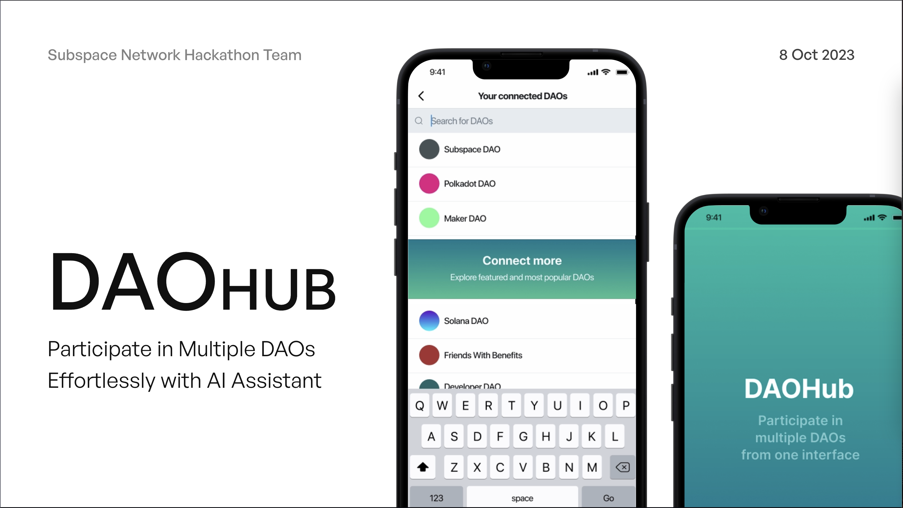
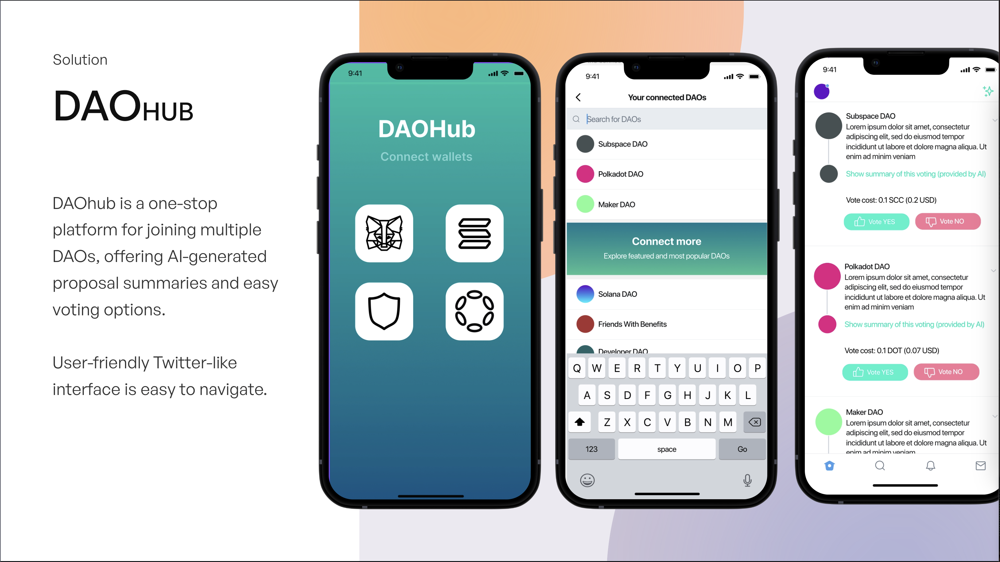

# DAOHub
All your DAOs in one place - ETH Rome 2023 hackaton project


## Run the Demo
The demo consists of 2 components:

1. [Sapial](https://github.com/sapial-ai/sapial) AI agent: To run the AI agent you would need OpenAI API key. Follow instructions on [Sapial ReadMe](./sapial@26ebd94c4554b38cde6a7e9bdacfd2e3c49d5518/readme.md)
2. Mobile client: To start a web client, run 
    ```bash 
    cd sapial@26ebd94c4554b38cde6a7e9bdacfd2e3c49d5518/clients/mobile
    yarn && yarn start
    ```

